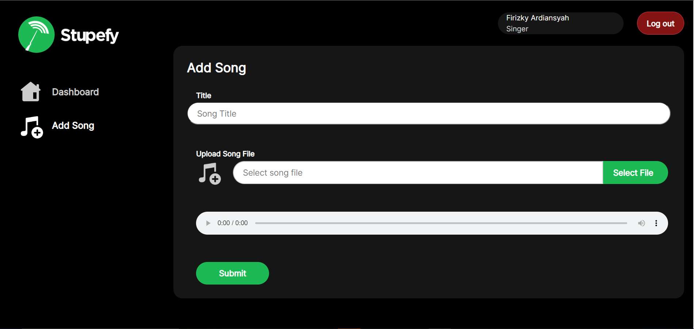

# Stupefy Premium App

# Quick Start

1. build: ```docker-compose build```
2. up: ```docker-compose up -d```
3. up production: ```docker-compose -f docker-compose.yml -f docker-compose.prod.yml up --build```
4. down: ```docker-compose down```
   
   
## Tugas Besar 2 - IF3110 Pengembangan Perangkat Lunak Berbasis Web<br>
Pengembangan aplikasi berbasis web dengan arsitektur *microservice*

## Author
- Ahmad Romy Zahran (13520009)
- Firizky Ardiansyah (13520095)
- Muhammad Fahmi Irfan (13520152)
  
## 1. Penjelasan Singkat
Stupefy premium merupakan ekstensi service stupefy app yang diperuntukkan bagi pengguna dengan *role* singer dan admin premium app. Singer akan dapat mengelola lagu-lagu premiumnya untuk diserve di stupefy app, adapun admin akan dapat mengelola permintaan subscription dari pengguna stupefy app.


## 2. Requirements
1. Docker
2. Browser
3. Vite
4. NodeJS

## 3. Cara Instalasi
1. Clone/Download repository ini.
2. Buatlah file ```.env``` pada root folder, salin field yang perlu diisi dari .env.example (jika sudah terisi, tidak perlu di ubah).
3. Jalankan ```docker compose build```
4. Tunggu hingga semua image berhasil di-*pull*.

## 4. Cara Menjalankan Server 
1.  Untuk menjalankan server lakukan dengan perintah
    ```
    docker-compose up -d
    ```
2. Jalankan web pada `localhost:3000`.


## 5. Screenshot Layar
### 5.1. Halaman Login
#### *Screen Capture*


### 5.2. Halaman Register
#### *Screen Capture*


### 5.3. Halaman Dashboard
#### *Screen Capture*


### 5.4. Halaman Penambahan Lagu
#### *Screen Capture*



### 5.4 Pengubahan Detail Lagu
###  *Screen Capture*


## 6. Pembagian Tugas
| Fitur  | 13520009 | 13520095 | 13520152 |
| --- | --- | --- | --- |
| Login |  | :white_check_mark: | :white_check_mark: |
| Register   |  | :white_check_mark: | :white_check_mark: |
| Dashboard   |  | :white_check_mark: |  |
| Pagination   |  | :white_check_mark: |  |
| Alert   |  | :white_check_mark: |  |
| Modal   |  | :white_check_mark: |  |
| Penambahan Lagu Baru  |  | :white_check_mark: |  |
| Penghapusan Lagu  |  | :white_check_mark: |  |
| Pemutaran Lagu  |  | :white_check_mark: |  |
| Pengubahan Detail Lagu  |  | :white_check_mark: |  |


